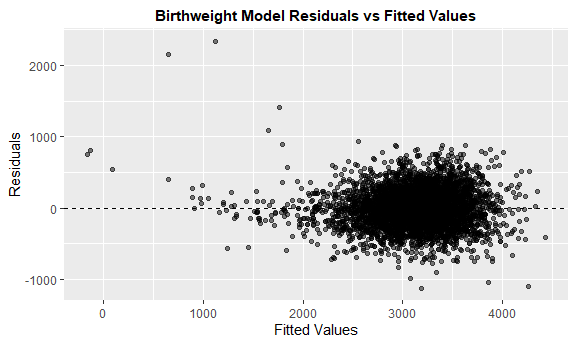

Homework 6
================
Arghya Kannadaguli (ak5357)
2024-11-26

# **Problem 2**

## *Homicide Statistics*

#### **Data Import**

Import Washington Post homicide data, with the following cleaning:

- Creating a `city_state` variable.
- Creating a binary `solved` variable indicating whether each reported
  case was solved.
- Recoding `victim_age` and other variables as numeric or factor where
  relevant.
- Filtering out cities that do not report race or have other data
  issues.
- Filtering out all races except `white` and `black`.

``` r
homicide_df = read_csv("data/homicide-data.csv") |> 
  mutate(
    city_state = paste0(city, ", ", state),
    solved = ifelse(disposition != "Open/No arrest", TRUE, FALSE),
    victim_age = as.numeric(ifelse(victim_age == "Unknown", NA, victim_age)),
    across(contains(c("race", "sex", "city", 
                      "state", "disposition")), as.factor)) |>
  filter(
    !city_state %in% c("Dallas, TX", "Phoenix, AZ", 
                       "Kansas City, MO", "Tulsa, AL"),
    victim_race %in% c("White", "Black"))
```

#### **Baltimore GLM**

For the city of Baltimore, MD, use the `glm` function to fit a logistic
regression with resolved vs unresolved as the outcome and victim age,
sex and race as predictors. Save the output of `glm` as an R object.

``` r
baltimore_homicides = homicide_df |> 
  filter(city_state == "Baltimore, MD")

baltimore_glm = baltimore_homicides |> 
  glm(solved ~ victim_age + victim_sex + victim_race, data = _, family = binomial())
```

Apply the `broom::tidy` to this object; and obtain the estimate and
confidence interval of the adjusted odds ratio for solving homicides
comparing male victims to female victims keeping all other variables
fixed.

``` r
baltimore_or = baltimore_glm |> 
  broom::tidy(conf.int = TRUE, exponentiate = TRUE) |> 
  filter(term == "victim_sexMale") |> 
  select(term, estimate, contains("conf"))

baltimore_or |> 
  knitr::kable()
```

| term           |  estimate |  conf.low | conf.high |
|:---------------|----------:|----------:|----------:|
| victim_sexMale | 0.3546711 | 0.2672667 | 0.4679109 |

#### **Pipeline for All Cities**

Now run `glm` for each of the cities in your dataset, and extract the
adjusted odds ratio (and CI) for solving homicides comparing male
victims to female victims. Do this within a “tidy” pipeline, making use
of `purrr::map`, list columns, and unnest as necessary to create a
dataframe with estimated ORs and CIs for each city.

``` r
cities_or = homicide_df |> 
  group_by(city_state) |> 
  nest() |> 
  mutate(
    model = map(data, ~ glm(solved ~ victim_age + victim_sex + victim_race,
                      data = .x, family = binomial())),
    tidy_model = map(model, ~ broom::tidy(.x, conf.int = TRUE, exponentiate = TRUE))
  ) |> 
  unnest(tidy_model) |> 
  filter(term == "victim_sexMale") |> 
  select(city_state, estimate, contains("conf"))
```

Create a plot that shows the estimated ORs and CIs for each city.
Organize cities according to estimated OR, and comment on the plot.

``` r
cities_or |> 
  ggplot(aes(x = reorder(city_state, estimate), y = estimate)) +
  geom_point() +
  geom_errorbar(aes(ymin = conf.low, ymax = conf.high), width = 0.5) +
  theme(axis.text.x = element_text(angle = 90, hjust = 1)) +
  labs(
    title = "Odds Ratios for Solved Homicides by City",
    x = "City",
    y = "Adjusted Odds Ratio\n(Male vs Female Victims)"
  )
```


# **Problem 3**

## *Birthweight*

#### **Data Import**

``` r
bwt_df = read_csv("data/birthweight.csv") |> 
  janitor::clean_names() |> 
  mutate(
    babysex = 
      case_match(babysex,
          1 ~ "male",
          2 ~ "female"),
    babysex = as.factor(babysex),
    malform = 
      case_match(malform,
          0 ~ "absent",
          1 ~ "present"),
    malform = as.factor(malform),
    frace =
      case_match(frace,
          1 ~ "white",
          2 ~ "black",
          3 ~ "asian",
          4 ~ "puerto rican",
          8 ~ "other"),
    frace = fct_infreq(frace),
    mrace = 
      case_match(mrace,
          1 ~ "white",
          2 ~ "black",
          3 ~ "asian",
          4 ~ "puerto rican",
          8 ~ "other"),
    mrace = fct_infreq(mrace))
```

Propose a regression model for birthweight. This model may be based on a
hypothesized structure for the factors that underly birthweight, on a
data-driven model-building process, or a combination of the two.
Describe your modeling process.

**Process**

First let’s see which variables have a statistically significant
association with birthweight (at the alpha = 0.05 level).

``` r
bwt_df |> 
  lm(bwt ~ babysex + bhead + blength + delwt + fincome + frace + gaweeks + malform + menarche + mheight + momage + mrace + parity + pnumlbw + pnumsga + ppbmi + ppwt + smoken + wtgain,
     data = _) |> 
  broom::tidy() |>  
  filter(p.value < 0.05, term != "(Intercept)") |> 
  arrange(-abs(estimate)) |> 
  knitr::kable()
```

| term        |    estimate |  std.error | statistic |   p.value |
|:------------|------------:|-----------:|----------:|----------:|
| mraceblack  | -151.435404 | 46.0453432 | -3.288832 | 0.0010141 |
| bhead       |  130.778145 |  3.4523248 | 37.881183 | 0.0000000 |
| parity      |   95.541114 | 40.4792711 |  2.360248 | 0.0183069 |
| blength     |   74.953578 |  2.0216656 | 37.075161 | 0.0000000 |
| babysexmale |  -28.707309 |  8.4652447 | -3.391197 | 0.0007021 |
| gaweeks     |   11.549387 |  1.4653680 |  7.881561 | 0.0000000 |
| smoken      |   -4.854363 |  0.5870549 | -8.269011 | 0.0000000 |
| delwt       |    4.100733 |  0.3948202 | 10.386330 | 0.0000000 |

I will use these variables shown above in my model.

``` r
model1 = bwt_df |> 
  lm(bwt ~ bhead + blength + delwt + gaweeks + mrace + parity + babysex + smoken, data = _)
```

Show a plot of model residuals against fitted values. Use
add_predictions and add_residuals in making this plot.

``` r
bwt_df |> 
  add_predictions(model1) |> 
  add_residuals(model1) |>
  ggplot(aes(x = pred, y = resid)) +
  geom_point(alpha = 0.5) +
  geom_hline(yintercept = 0, linetype = "dashed") +
  labs(
    title = "Birthweight Model Residuals vs Fitted Values",
    x = "Fitted Values",
    y = "Residuals")
```



Compare your model to two others:

- One using length at birth and gestational age as predictors (main
  effects only)
- One using head circumference, length, sex, and all interactions
  (including the three-way interaction) between these

**Model 1**

``` r
model2 = lm(bwt ~ blength + gaweeks, data = bwt_df)
model2 |> 
  broom::tidy() |> 
  knitr::kable()
```

| term        |    estimate | std.error | statistic | p.value |
|:------------|------------:|----------:|----------:|--------:|
| (Intercept) | -4347.66707 | 97.958360 | -44.38281 |       0 |
| blength     |   128.55569 |  1.989891 |  64.60439 |       0 |
| gaweeks     |    27.04673 |  1.717930 |  15.74379 |       0 |

**Model 2**

``` r
model3 = lm(bwt ~ bhead * blength * babysex, data = bwt_df)
model3 |> 
  broom::tidy() |> 
  knitr::kable()
```

| term                      |     estimate |    std.error |  statistic |   p.value |
|:--------------------------|-------------:|-------------:|-----------:|----------:|
| (Intercept)               |  -801.948671 | 1102.3077046 | -0.7275180 | 0.4669480 |
| bhead                     |   -16.597546 |   34.0916082 | -0.4868514 | 0.6263883 |
| blength                   |   -21.645964 |   23.3720477 | -0.9261475 | 0.3544209 |
| babysexmale               | -6374.868351 | 1677.7669213 | -3.7996150 | 0.0001469 |
| bhead:blength             |     3.324444 |    0.7125586 |  4.6655020 | 0.0000032 |
| bhead:babysexmale         |   198.393181 |   51.0916850 |  3.8830816 | 0.0001047 |
| blength:babysexmale       |   123.772887 |   35.1185360 |  3.5244319 | 0.0004288 |
| bhead:blength:babysexmale |    -3.878053 |    1.0566296 | -3.6702106 | 0.0002453 |

Make this comparison in terms of the cross-validated prediction error;
use `crossv_mc` and functions in purrr as appropriate.

``` r
bwt_split = crossv_mc(bwt_df, 100)

bwt_cv = bwt_split |> 
  mutate(
    model1 = map(train, \(x) lm(bwt ~ bhead + blength + delwt + gaweeks + mrace + parity + babysex + smoken, data = x)),
    model2 = map(train, \(x) lm(bwt ~ blength + gaweeks, data = x)),
    model3 = map(train, \(x) lm(bwt ~ bhead * blength * babysex, data = x))
  ) |> 
  mutate(
    rmse1 = map2_dbl(model1, test, rmse),
    rmse2 = map2_dbl(model2, test, rmse),
    rmse3 = map2_dbl(model3, test, rmse)
  )
```

``` r
bwt_cv |> 
  summarize(
    mean_error1 = mean(rmse1),
    mean_error2 = mean(rmse2),
    mean_error3 = mean(rmse3)
  ) |> 
  knitr::kable()
```

| mean_error1 | mean_error2 | mean_error3 |
|------------:|------------:|------------:|
|    274.9591 |    333.1876 |    289.2892 |

Since Model 1 has the lowest error, this suggests that the factors I
chose are effective predictors. This makes sense because their p-values
were significant in the initial test model examining main effects of all
variables. However, Model 3 has a similar error to Model 1, which
suggests that the added complexity of Model 1 may not necessarily
enhance its predictive power.
