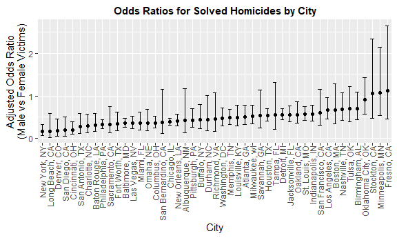

Homework 6
================
Arghya Kannadaguli (ak5357)
2024-11-26

# **Problem 2**

## *Homicide Statistics*

#### **Data Import**

Import Washington Post homicide data, with the following cleaning:

- Creating a `city_state` variable.
- Creating a binary `solved` variable indicating whether each reported
  case was solved.
- Recoding `victim_age` and other variables as numeric or factor where
  relevant.
- Filtering out cities that do not report race or have other data
  issues.
- Filtering out all races except `white` and `black`.

``` r
homicide_df = read_csv("data/homicide-data.csv") |> 
  mutate(
    city_state = paste0(city, ", ", state),
    solved = ifelse(disposition != "Open/No arrest", TRUE, FALSE),
    victim_age = as.numeric(ifelse(victim_age == "Unknown", NA, victim_age)),
    across(contains(c("race", "sex", "city", 
                      "state", "disposition")), as.factor)) |>
  filter(
    !city_state %in% c("Dallas, TX", "Phoenix, AZ", 
                       "Kansas City, MO", "Tulsa, AL"),
    victim_race %in% c("White", "Black"))
```

#### **Baltimore GLM**

For the city of Baltimore, MD, use the `glm` function to fit a logistic
regression with resolved vs unresolved as the outcome and victim age,
sex and race as predictors. Save the output of `glm` as an R object.

``` r
baltimore_homicides = homicide_df |> 
  filter(city_state == "Baltimore, MD")

baltimore_glm = baltimore_homicides |> 
  glm(solved ~ victim_age + victim_sex + victim_race, data = _, family = binomial())
```

Apply the `broom::tidy` to this object; and obtain the estimate and
confidence interval of the adjusted odds ratio for solving homicides
comparing male victims to female victims keeping all other variables
fixed.

``` r
baltimore_or = baltimore_glm |> 
  broom::tidy(conf.int = TRUE, exponentiate = TRUE) |> 
  filter(term == "victim_sexMale") |> 
  select(term, estimate, contains("conf"))

baltimore_or |> 
  knitr::kable()
```

| term           |  estimate |  conf.low | conf.high |
|:---------------|----------:|----------:|----------:|
| victim_sexMale | 0.3546711 | 0.2672667 | 0.4679109 |

#### **Pipeline for All Cities**

Now run `glm` for each of the cities in your dataset, and extract the
adjusted odds ratio (and CI) for solving homicides comparing male
victims to female victims. Do this within a “tidy” pipeline, making use
of `purrr::map`, list columns, and unnest as necessary to create a
dataframe with estimated ORs and CIs for each city.

``` r
cities_or = homicide_df |> 
  group_by(city_state) |> 
  nest() |> 
  mutate(
    model = map(data, ~ glm(solved ~ victim_age + victim_sex + victim_race,
                      data = .x, family = binomial())),
    tidy_model = map(model, ~ broom::tidy(.x, conf.int = TRUE, exponentiate = TRUE))
  ) |> 
  unnest(tidy_model) |> 
  filter(term == "victim_sexMale") |> 
  select(city_state, estimate, contains("conf"))
```

Create a plot that shows the estimated ORs and CIs for each city.
Organize cities according to estimated OR, and comment on the plot.

``` r
cities_or |> 
  ggplot(aes(x = reorder(city_state, estimate), y = estimate)) +
  geom_point() +
  geom_errorbar(aes(ymin = conf.low, ymax = conf.high), width = 0.5) +
  theme(axis.text.x = element_text(angle = 90, hjust = 1)) +
  labs(
    title = "Odds Ratios for Solved Homicides by City",
    x = "City",
    y = "Adjusted Odds Ratio\n(Male vs Female Victims)"
  )
```



# **Problem 3**

## *Birthweight*

#### **Data Import**

``` r
bwt_df = read_csv("data/birthweight.csv") |> 
  janitor::clean_names() |> 
  mutate(
    babysex = 
      case_match(babysex,
          1 ~ "male",
          2 ~ "female"),
    babysex = as.factor(babysex),
    malform = 
      case_match(malform,
          0 ~ "absent",
          1 ~ "present"),
    malform = as.factor(malform),
    frace =
      case_match(frace,
          1 ~ "white",
          2 ~ "black",
          3 ~ "asian",
          4 ~ "puerto rican",
          8 ~ "other"),
    frace = fct_infreq(frace),
    mrace = 
      case_match(mrace,
          1 ~ "white",
          2 ~ "black",
          3 ~ "asian",
          4 ~ "puerto rican",
          8 ~ "other"),
    mrace = fct_infreq(mrace))
```

Propose a regression model for birthweight. This model may be based on a
hypothesized structure for the factors that underly birthweight, on a
data-driven model-building process, or a combination of the two.
Describe your modeling process.

**Hypothesis and process descrption:** I hypothesize that the following
variables will be associated with birthweight.

- baby sex
- family income (proxy for socioeconomic status)
- gestational age in weeks
- mother’s height
- mother’s smoking

``` r
bwt_model = bwt_df |> 
  lm(bwt ~ babysex + fincome + gaweeks + mheight + smoken, data = _)
```

Show a plot of model residuals against fitted values. Use
add_predictions and add_residuals in making this plot.

``` r
bwt_df |> 
  add_predictions(bwt_model) |> 
  add_residuals(bwt_model) |>
  ggplot(aes(x = pred, y = resid)) +
  geom_point(alpha = 0.5) +
  geom_hline(yintercept = 0, linetype = "dashed") +
  labs(
    title = "Birthweight Model Residuals vs Fitted Values",
    x = "Fitted Values",
    y = "Residuals")
```


